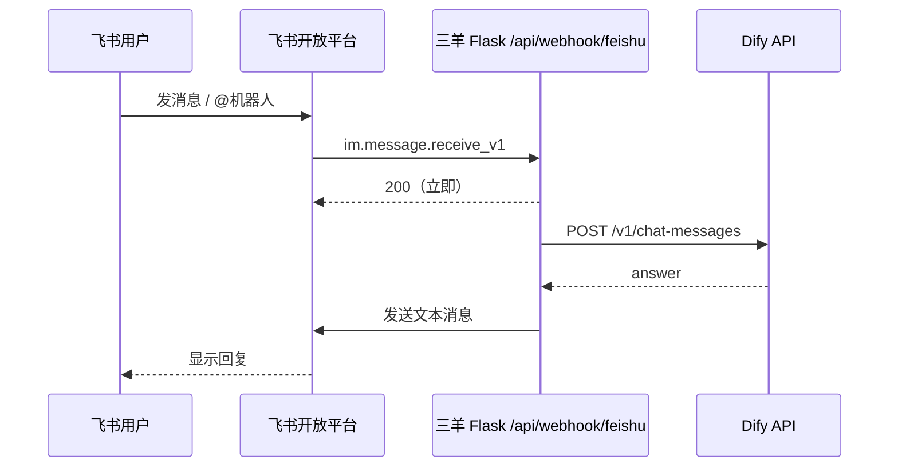

# 飞书机器人对接 Dify

本仓库提供 **Webhook 桥接**：飞书把消息事件推到三羊系统，由 `feishu_dify.py` 调用 Dify「对话型应用」API，再把回复发回飞书。

## 架构



回调地址必须是 **公网 HTTPS**（飞书无法访问你电脑内网）。

| 部署方式 | 飞书回调填什么 | `DIFY_API_BASE` 填什么 |
|----------|----------------|-------------------------|
| **Dify 在 WSL 本机**（推荐联调） | ngrok 暴露的本机桥接，见下文「WSL 本机 Dify」 | `http://127.0.0.1/v1` |
| **Dify 与三羊同机/公网可达** | `https://feijihe.top/api/webhook/feishu` 等 | 你的 Dify 公网 `/v1` |
| **Dify 本机 + 桥接在 feijihe 服务器** | 仍用 feijihe 域名 | 须用 **frp/内网穿透** 把 WSL 的 80 映射成服务器能访问的 URL（不推荐新手） |

线上三羊（任选其一，共用同一路由）：

- 客服端：`https://zean.feijihe.top/api/webhook/feishu`
- 生产端：`https://feijihe.top/api/webhook/feishu`

探活：`GET /api/webhook/feishu` 返回 `enabled` 是否为 true。

---

## WSL 本机 Dify（你当前场景）

本机已检测到 Dify Docker（`docker-nginx-1` 监听 **80** 端口）。对话 API 一般为：

```env
DIFY_API_BASE=http://127.0.0.1/v1
DIFY_API_KEY=app-你在Dify应用里复制的密钥
```

**不要**把 `DIFY_API_BASE` 写成 `https://api.dify.ai`（那是云端，不是你 WSL 里的实例）。

### 推荐联调拓扑

```
飞书云 ──HTTPS──► ngrok/cloudflared ──► Windows:5099 ──► feishu_dify.py
                                                      └──HTTP──► WSL:80/v1 (Dify)
```

1. 在项目根目录配置 `.env`（可复制 `.env.example` 里飞书+Dify 段），并设 `FEISHU_DIFY_ENABLED=true`。
2. 启动本机桥接（只需能 import Flask，不必连生产 MySQL）：

```powershell
cd D:\Desktop\sanyang-system
$env:MYSQL_PASSWORD="local"
python scripts/feishu_dify_local.py
```

浏览器打开 `http://127.0.0.1:5099/`，应看到 `"enabled": true`。

3. 另开终端暴露 **5099**（不是 Dify 的 80）：

```powershell
ngrok http 5099
```

4. 飞书开发者后台 → 事件订阅 → 请求地址填：

`https://<你的-ngrok域名>/api/webhook/feishu`

5. 在 Dify 网页（WSL 里一般是 `http://localhost` 或安装时写的域名）创建聊天应用并复制 API Key。

6. 飞书里 @机器人 发消息测试。

### WSL 访问说明

- 桥接脚本在 **Windows** 跑时，用 `http://127.0.0.1/v1` 即可（WSL2 会把 80 端口转发到 Windows 本机）。
- 若桥接也放在 **WSL 里**跑，同样用 `http://127.0.0.1/v1`。
- 若 `curl http://127.0.0.1/v1/...` 返回 502，先确认 Dify 容器都 Up：`wsl docker ps`，必要时 `docker compose up -d`。

### 从 Windows 测 Dify API 是否通

```powershell
wsl curl -s -o NUL -w "%{http_code}" http://127.0.0.1/
# 根路径 307/200 表示 nginx 在；再用 Dify 应用 API Key 调 chat-messages 即可
```

## 一、Dify 侧

1. 在 Dify 创建 **聊天助手**（或 Agent，需支持对话 API）。
2. 进入应用 → **访问 API** → 复制 **API Key**（形如 `app-xxx`）。
3. 记下 API 根地址：
   - **WSL/本机自建**：`http://127.0.0.1/v1`（端口以你 nginx 为准，常见 80）
   - 云版：`https://api.dify.ai/v1`
   - 公网自建：`https://你的域名/v1`

## 二、飞书开放平台

1. 打开 [飞书开发者后台](https://open.feishu.cn/app) → 创建 **企业自建应用**。
2. **权限**（权限管理 → 批量开通）至少包含：
   - `im:message`
   - `im:message:send_as_bot`
   - `im:message.group_at_msg:readonly`（群聊 @ 机器人）
3. **机器人**：启用机器人能力。
4. **事件订阅**：
   - 订阅方式：**将事件发送至开发者服务器**
   - 请求地址：上节的 `https://.../api/webhook/feishu`
   - 添加事件：`im.message.receive_v1`
   - 若启用 **Encrypt Key**，把同一密钥填到 `.env` 的 `FEISHU_ENCRYPT_KEY`（代码会做签名校验与解密）。
5. **凭证与基础信息**：复制 App ID、App Secret。
6. 发布应用版本，并把机器人 **添加到群** 或允许用户 **单聊**。

群聊默认 **仅在被 @ 时回复**；若希望群内所有文字都触发，设置 `FEISHU_GROUP_REPLY_ALL=true`。

可选：`FEISHU_BOT_OPEN_ID` 填机器人 open_id，用于精确识别 @（不填时，群里有任意 @ 即会回复）。

## 三、服务器 `.env`

在 `/www/feijihe/stable/.env` 增加：

```env
FEISHU_DIFY_ENABLED=true
FEISHU_APP_ID=cli_xxxxxxxx
FEISHU_APP_SECRET=xxxxxxxx
FEISHU_ENCRYPT_KEY=xxxxxxxx
FEISHU_VERIFICATION_TOKEN=xxxxxxxx
DIFY_API_BASE=https://api.dify.ai/v1
DIFY_API_KEY=app-xxxxxxxx
```

部署代码后重启 3001 或 3002（与你在飞书填的域名一致即可）：

```bash
cd /www/feijihe/repo && git pull && ./deploy.sh
# 按现网方式 restart cs 或 prod
```

## 四、验收

1. 飞书后台「事件订阅」→ **保存** 时应通过 URL 校验（返回 challenge）。
2. `curl -s https://feijihe.top/api/webhook/feishu` 应看到 `"enabled": true`。
3. 单聊机器人或群里 **@机器人** 发文字，应收到 Dify 回复。

## 五、常见问题

| 现象 | 处理 |
|------|------|
| URL 校验失败 | 确认 HTTPS、Nginx 反代未拦 POST body；`FEISHU_ENCRYPT_KEY` 与后台一致 |
| enabled 为 false | 检查 `FEISHU_DIFY_ENABLED` 与 App/Dify 密钥是否齐全 |
| 群聊无反应 | 需要 @机器人，或设 `FEISHU_GROUP_REPLY_ALL=true` |
| Dify 报错 | 确认是「对话型」应用 API Key；`DIFY_API_BASE` 须带 `/v1` |
| 重复回复 | 飞书可能重推事件，已做 event_id 去重；仍异常可查飞书事件日志 |

## 六、替代方案（不经过本仓库）

若希望独立服务、流式卡片、多应用管理，可选用社区项目：

- [FeishuRBT](https://github.com/anycodes/FeishuRBT)（Python + Web 管理）
- [dify-on-lark](https://github.com/duhongming1990/dify-on-lark)（Java / Docker）

本方案适合：**已有三羊域名与 deploy 流程**，只需一个回调 URL、配置写在现有 `.env`。
